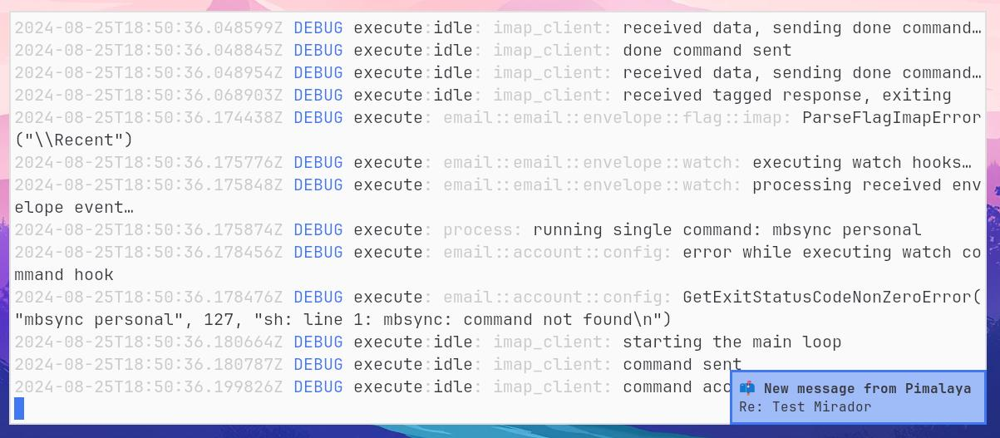

# 🔭 Mirador [](https://github.com/soywod/mirador/releases/latest) [](https://matrix.to/#/#pimalaya:matrix.org)

CLI to watch mailbox changes, based on [`email-lib`](https://crates.io/crates/email-lib)



## Features

- Watches and executes actions on mailbox changes
- Interactive configuration via **wizard** (requires `wizard` feature)
- Supported events: **on message added**.
- Supported actions: **send system notification**, **execute shell command**.
- Supports **IMAP** mailboxes (requires `imap` feature)
- Supports **Maildir** folders (requires `maildir` feature)
- Supports global system **keyring** to manage secrets (requires `keyring` feature)
- Supports **OAuth 2.0** (requires `oauth2` feature)

*Mirador CLI is written in [Rust](https://www.rust-lang.org/), and relies on [cargo features](https://doc.rust-lang.org/cargo/reference/features.html) to enable or disable functionalities. Default features can be found in the `features` section of the [`Cargo.toml`](https://github.com/pimalaya/mirador/blob/master/Cargo.toml#L18).*

## Installation

Mirador CLI can be installed with a prebuilt binary:

```bash
# As root:
$ curl -sSL https://raw.githubusercontent.com/pimalaya/mirador/master/install.sh | sudo sh

# As a regular user:
$ curl -sSL https://raw.githubusercontent.com/pimalaya/mirador/master/install.sh | PREFIX=~/.local sh
```

These commands install the latest binary from the GitHub [releases](https://github.com/pimalaya/mirador/releases) section.

*Binaries are built with [default](https://github.com/pimalaya/mirador/blob/master/Cargo.toml#L18) cargo features. If you want to enable or disable a feature, please use another installation method.*

<details>
  <summary>Cargo</summary>

  Mirador CLI can be installed with [cargo](https://doc.rust-lang.org/cargo/):

  ```bash
  $ cargo install mirador

  # With only IMAP support:
  $ cargo install mirador --no-default-features --features imap
  ```

  You can also use the git repository for a more up-to-date (but less stable) version:

  ```bash
  $ cargo install --git https://github.com/pimalaya/mirador.git mirador
  ```
</details>

<details>
  <summary>Nix</summary>

  Mirador CLI can be installed with [Nix](https://serokell.io/blog/what-is-nix):

  ```bash
  $ nix-env -i mirador
  ```

  You can also use the git repository for a more up-to-date (but less stable) version:

  ```bash
  $ nix-env -if https://github.com/pimalaya/mirador/archive/master.tar.gz

  # or, from within the source tree checkout
  $ nix-env -if .
  ```

  If you have the [Flakes](https://nixos.wiki/wiki/Flakes) feature enabled:

  ```bash
  $ nix profile install mirador

  # or, from within the source tree checkout
  $ nix profile install

  # you can also run Mirador directly without installing it:
  $ nix run mirador
  ```
</details>

<details>
  <summary>Sources</summary>

  Mirador CLI can be installed from sources.

  First you need to install the Rust development environment (see the [rust installation documentation](https://doc.rust-lang.org/cargo/getting-started/installation.html)):

  ```bash
  $ curl https://sh.rustup.rs -sSf | sh
  ```

  Then, you need to clone the repository and install dependencies:

  ```bash
  $ git clone https://github.com/pimalaya/mirador.git
  $ cd mirador
  $ cargo check
  ```

  Now, you can build Mirador:

  ```bash
  $ cargo build --release
  ```

  *Binaries are available under the `target/release` folder.*
</details>

## Configuration

Just run `mirador`, the wizard will help you to configure your default account.

You can also manually edit your own configuration, from scratch:

- Copy the content of the documented [`./config.sample.toml`](./config.sample.toml)
- Paste it in a new file `~/.config/mirador/config.toml`
- Edit, then comment or uncomment the options you want

<details>
  <summary>Proton Mail (Bridge)</summary>

  When using Proton Bridge, emails are synchronized locally and exposed via a local IMAP/SMTP server. This implies 2 things:

  - Id order may be reversed or shuffled, but envelopes will still be sorted by date.
  - SSL/TLS needs to be deactivated manually.
  - The password to use is the one generated by Proton Bridge, not the one from your Proton Mail account.

  ```toml
  [accounts.proton]
  default = true
  folder = "INBOX"

  backend.type = "imap"
  backend.host = "127.0.0.1"
  backend.port = 1143
  backend.encryption = false
  backend.login = "example@proton.me"
  backend.passwd.raw = "<proton-bridge-generated-password>"

  on-message-added.notify.summary = "Proton: new message from {sender}"
  on-message-added.notify.body = "{subject}"
  ```

  Keeping your password inside the configuration file is good for testing purpose, but it is not safe. You have 2 better alternatives:

  - Save your password in any password manager that can be queried via the CLI:

    ```toml
    backend.passwd.cmd = "pass show proton"
    ```

  - Use the global keyring of your system (requires the `keyring` cargo feature):

    ```toml
    backend.passwd.keyring = "proton-example"
    ```

    Running `mirador configure -a proton` will ask for your IMAP password, just paste the one generated previously.
</details>

<details>
  <summary>Gmail</summary>

  Google passwords cannot be used directly. There is two ways to authenticate yourself:

  ### Using [App Passwords](https://support.google.com/mail/answer/185833)

  This option is the simplest and the fastest. First, be sure that:

  - IMAP is enabled
  - Two-step authentication is enabled
  - Less secure app access is enabled

  First create a [dedicated password](https://myaccount.google.com/apppasswords) for Mirador.

  ```toml
  [accounts.gmail]
  default = true
  folder = "INBOX"

  backend.type = "imap"
  backend.host = "imap.gmail.com"
  backend.port = 993
  backend.encryption = "tls"
  backend.login = "example@gmail.com"
  backend.passwd.raw = "<generated-password>"

  on-message-added.notify.summary = "Gmail: new message from {sender}"
  on-message-added.notify.body = "{subject}"
  ```

  Keeping your password inside the configuration file is good for testing purpose, but it is not safe. You have 2 better alternatives:

  - Save your password in any password manager that can be queried via the CLI:

    ```toml
    backend.passwd.cmd = "pass show gmail"
    ```

  - Use the global keyring of your system (requires the `keyring` cargo feature):

    ```toml
    backend.passwd.keyring = "gmail-example"
    ```

    Running `mirador configure -a gmail` will ask for your IMAP password, just paste the one generated previously.

  ### Using OAuth 2.0

  This option is the most secure but the hardest to configure. It requires the `oauth2` and `keyring` cargo features.

  First, you need to get your OAuth 2.0 credentials by following [this guide](https://developers.google.com/identity/protocols/oauth2#1.-obtain-oauth-2.0-credentials-from-the-dynamic_data.setvar.console_name-.). Once you get your client id and your client secret, you can configure your Mirador account this way:

  ```toml
  [accounts.gmail]
  default = true
  folder = "INBOX"

  backend.type = "imap"
  backend.host = "imap.gmail.com"
  backend.port = 993
  backend.login = "example@gmail.com"
  backend.oauth2.client-id = "<client-id>"
  backend.oauth2.auth-url = "https://accounts.google.com/o/oauth2/v2/auth"
  backend.oauth2.token-url = "https://www.googleapis.com/oauth2/v3/token"
  backend.oauth2.pkce = true
  backend.oauth2.scope = "https://mail.google.com/"

  on-message-added.notify.summary = "Gmail: new message from {sender}"
  on-message-added.notify.body = "{subject}"
  ```

  Running `mirador configure -a gmail` will complete your OAuth 2.0 setup and ask for your client secret.
</details>

<details>
  <summary>Outlook</summary>

  ```toml
  [accounts.outlook]
  default = true
  folder = "INBOX"

  backend.type = "imap"
  backend.host = "outlook.office365.com"
  backend.port = 993
  backend.encryption = "tls"
  backend.login = "example@outlook.com"
  backend.passwd.cmd = "pass show outlook"

  on-message-added.notify.summary = "Outlook: new message from {sender}"
  on-message-added.notify.body = "{subject}"
  ```

  ### Using OAuth 2.0

  This option is the most secure but the hardest to configure. First, you need to get your OAuth 2.0 credentials by following [this guide](https://learn.microsoft.com/en-us/exchange/client-developer/legacy-protocols/how-to-authenticate-an-imap-pop-smtp-application-by-using-oauth). Once you get your client id and your client secret, you can configure your Mirador account this way:

  ```toml
  [accounts.outlook]
  default = true
  folder = "INBOX"

  backend.type = "imap"
  backend.host = "outlook.office365.com"
  backend.port = 993
  backend.login = "example@outlook.com"
  backend.oauth2.client-id = "<client-id>"
  backend.oauth2.auth-url = "https://login.microsoftonline.com/common/oauth2/v2.0/authorize"
  backend.oauth2.token-url = "https://login.microsoftonline.com/common/oauth2/v2.0/token"
  backend.oauth2.pkce = true
  backend.oauth2.scopes = ["https://outlook.office.com/IMAP.AccessAsUser.All"]

  on-message-added.notify.summary = "Outlook: new message from {sender}"
  on-message-added.notify.body = "{subject}"
  ```

  Running `mirador configure -a outlook` will complete your OAuth 2.0 setup and ask for your client secret.
</details>

<details>
  <summary>iCloud Mail</summary>

  From the [iCloud Mail](https://support.apple.com/en-us/HT202304) support page:

  - IMAP port = `993`.
  - IMAP login = name of your iCloud Mail email address (for example, `johnappleseed`, not `johnappleseed@icloud.com`)
  - SMTP port = `587` with `STARTTLS`
  - SMTP login = full iCloud Mail email address (for example, `johnappleseed@icloud.com`, not `johnappleseed`)

  ```toml
  [accounts.icloud]
  default = true
  folder = "INBOX"

  backend.type = "imap"
  backend.host = "imap.mail.me.com"
  backend.port = 993
  backend.encryption = "tls"
  backend.login = "johnappleseed"
  backend.passwd.cmd = "security find-internet-password -s 'johnappleseed'"

  on-message-added.notify.summary = "iCloud: new message from {sender}"
  on-message-added.notify.body = "{subject}"
  ```
</details>

## FAQ

<details>
  <summary>How to debug Mirador CLI?</summary>

  The simplest way is to use `--debug` and `--trace` arguments.

  The advanced way is based on environment variables:

  - `RUST_LOG=<level>`: determines the log level filter, can be one of `off`, `error`, `warn`, `info`, `debug` and `trace`.
  - `RUST_SPANTRACE=1`: enables the spantrace (a span represent periods of time in which a program was executing in a particular context).
  - `RUST_BACKTRACE=1`: enables the error backtrace.
  - `RUST_BACKTRACE=full`: enables the full error backtrace, which include source lines where the error originated from.

  Logs are written to the `stderr`, which means that you can redirect them easily to a file:

  ```
  RUST_LOG=debug mirador watch 2>/tmp/mirador.log
  ```
</details>

<details>
  <summary>How the wizard discovers IMAP configs?</summary>

  All the lookup mechanisms use the email address domain as base for the lookup. It is heavily inspired from the Thunderbird [Autoconfiguration](https://udn.realityripple.com/docs/Mozilla/Thunderbird/Autoconfiguration) protocol. For example, for the email address `test@example.com`, the lookup is performed as (in this order):

  1. check for `autoconfig.example.com`
  2. look up of `example.com` in the ISPDB (the Thunderbird central database)
  3. look up `MX example.com` in DNS, and for `mx1.mail.hoster.com`, look up `hoster.com` in the ISPDB
  4. look up `SRV example.com` in DNS
  5. try to guess (`imap.example.com`, `smtp.example.com`…)
</details>
	
## Sponsoring

[](https://nlnet.nl/project/Pimalaya/index.html)

Special thanks to the [NLnet foundation](https://nlnet.nl/project/Pimalaya/index.html) and the [European Commission](https://www.ngi.eu/) that helped the project to receive financial support from:

- [NGI Assure](https://nlnet.nl/assure/) in 2022
- [NGI Zero Entrust](https://nlnet.nl/entrust/) in 2023

If you appreciate the project, feel free to donate using one of the following providers:

[](https://github.com/sponsors/soywod)
[](https://ko-fi.com/soywod)
[](https://www.buymeacoffee.com/soywod)
[](https://liberapay.com/soywod)
[![thanks.dev](https://img.shields.io/badge/-thanks.dev-000000?logo=data:image/svg+xml;base64,PHN2ZyB3aWR0aD0iMjQuMDk3IiBoZWlnaHQ9IjE3LjU5NyIgY2xhc3M9InctMzYgbWwtMiBsZzpteC0wIHByaW50Om14LTAgcHJpbnQ6aW52ZXJ0IiB4bWxucz0iaHR0cDovL3d3dy53My5vcmcvMjAwMC9zdmciPjxwYXRoIGQ9Ik05Ljc4MyAxNy41OTdINy4zOThjLTEuMTY4IDAtMi4wOTItLjI5Ny0yLjc3My0uODktLjY4LS41OTMtMS4wMi0xLjQ2Mi0xLjAyLTIuNjA2di0xLjM0NmMwLTEuMDE4LS4yMjctMS43NS0uNjc4LTIuMTk1LS40NTItLjQ0Ni0xLjIzMi0uNjY5LTIuMzQtLjY2OUgwVjcuNzA1aC41ODdjMS4xMDggMCAxLjg4OC0uMjIyIDIuMzQtLjY2OC40NTEtLjQ0Ni42NzctMS4xNzcuNjc3LTIuMTk1VjMuNDk2YzAtMS4xNDQuMzQtMi4wMTMgMS4wMjEtMi42MDZDNS4zMDUuMjk3IDYuMjMgMCA3LjM5OCAwaDIuMzg1djEuOTg3aC0uOTg1Yy0uMzYxIDAtLjY4OC4wMjctLjk4LjA4MmExLjcxOSAxLjcxOSAwIDAgMC0uNzM2LjMwN2MtLjIwNS4xNTYtLjM1OC4zODQtLjQ2LjY4Mi0uMTAzLjI5OC0uMTU0LjY4Mi0uMTU0IDEuMTUxVjUuMjNjMCAuODY3LS4yNDkgMS41ODYtLjc0NSAyLjE1NS0uNDk3LjU2OS0xLjE1OCAxLjAwNC0xLjk4MyAxLjMwNXYuMjE3Yy44MjUuMyAxLjQ4Ni43MzYgMS45ODMgMS4zMDUuNDk2LjU3Ljc0NSAxLjI4Ny43NDUgMi4xNTR2MS4wMjFjMCAuNDcuMDUxLjg1NC4xNTMgMS4xNTIuMTAzLjI5OC4yNTYuNTI1LjQ2MS42ODIuMTkzLjE1Ny40MzcuMjYuNzMyLjMxMi4yOTUuMDUuNjIzLjA3Ni45ODQuMDc2aC45ODVabTE0LjMxNC03LjcwNmgtLjU4OGMtMS4xMDggMC0xLjg4OC4yMjMtMi4zNC42NjktLjQ1LjQ0NS0uNjc3IDEuMTc3LS42NzcgMi4xOTVWMTQuMWMwIDEuMTQ0LS4zNCAyLjAxMy0xLjAyIDIuNjA2LS42OC41OTMtMS42MDUuODktMi43NzQuODloLTIuMzg0di0xLjk4OGguOTg0Yy4zNjIgMCAuNjg4LS4wMjcuOTgtLjA4LjI5Mi0uMDU1LjUzOC0uMTU3LjczNy0uMzA4LjIwNC0uMTU3LjM1OC0uMzg0LjQ2LS42ODIuMTAzLS4yOTguMTU0LS42ODIuMTU0LTEuMTUydi0xLjAyYzAtLjg2OC4yNDgtMS41ODYuNzQ1LTIuMTU1LjQ5Ny0uNTcgMS4xNTgtMS4wMDQgMS45ODMtMS4zMDV2LS4yMTdjLS44MjUtLjMwMS0xLjQ4Ni0uNzM2LTEuOTgzLTEuMzA1LS40OTctLjU3LS43NDUtMS4yODgtLjc0NS0yLjE1NXYtMS4wMmMwLS40Ny0uMDUxLS44NTQtLjE1NC0xLjE1Mi0uMTAyLS4yOTgtLjI1Ni0uNTI2LS40Ni0uNjgyYTEuNzE5IDEuNzE5IDAgMCAwLS43MzctLjMwNyA1LjM5NSA1LjM5NSAwIDAgMC0uOTgtLjA4MmgtLjk4NFYwaDIuMzg0YzEuMTY5IDAgMi4wOTMuMjk3IDIuNzc0Ljg5LjY4LjU5MyAxLjAyIDEuNDYyIDEuMDIgMi42MDZ2MS4zNDZjMCAxLjAxOC4yMjYgMS43NS42NzggMi4xOTUuNDUxLjQ0NiAxLjIzMS42NjggMi4zNC42NjhoLjU4N3oiIGZpbGw9IiNmZmYiLz48L3N2Zz4=)](https://thanks.dev/soywod)
[](https://www.paypal.com/paypalme/soywod)
